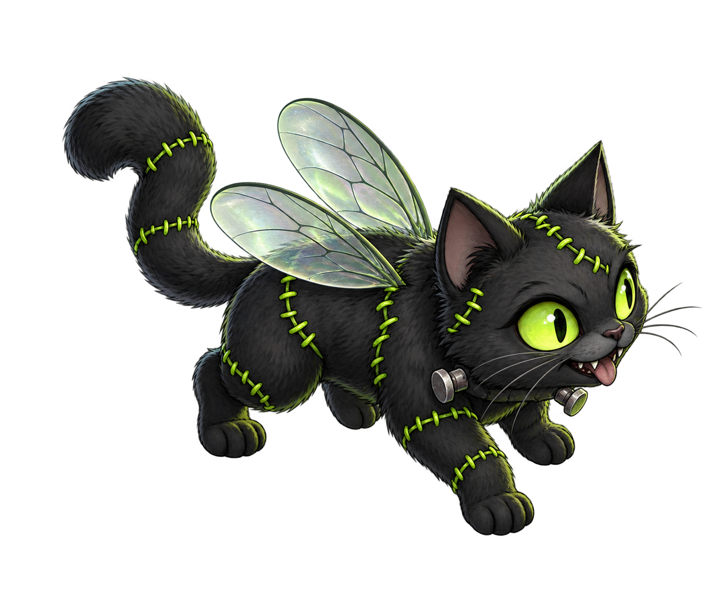

# Frankenfly

**A fruit-fly connectome. A very questionable cat.**

Frankenfly connects a measured fruit-fly neural wiring diagram to a virtual
Frankenstein cat. Place light, shadow or a synthetic olfactory pulse in its
chamber and watch the motor readout and neuron activity change.



## What runs today

- The FlyEM male CNS v1.0 graph: **165,122 traced neurons and 10,228,000 signed edges**, reproduced from verified source files.
- A CPU leaky integrate-and-fire model using short observation windows, based on [fruitflydev/flycoinrh](https://github.com/fruitflydev/flycoinrh).
- A virtual cat, a bounded arena, three stimulus types and collision handling.
- Actual retina samples, measured neuron positions and recorded neural firing.
- One shared simulation for every viewer. Additional viewers do not instantiate additional brains.
- Operator-protected controls, session checkpoints, Docker Compose and optional HTTPS through Caddy.

This is an experimental sensorimotor mapping. It is not a living animal,
continuous brain emulation, a trained cat, or evidence of consciousness.
As in the upstream implementation, neuron voltages restart at rest for each
12 ms observation window. The arena and RNG state persist. There is no
learning in v0.1. No target-seeking AI or scripted wandering drives the cat.
The model may walk backwards, spin or remain against a wall.

See [the model description](docs/MODEL.md) for the exact engineering choices.

## Quick start with Docker

**Existing shared server without Docker:** use the
[isolated native installer (Polish)](docs/NATIVE_PL.md). It adds only
Frankenfly, uses a private Python environment, limits CPU/RAM, and initially
listens on localhost:18080. It does not install Docker or change the host's
existing reverse proxy, firewall or other applications.

Prerequisites: a Linux server with Docker Engine and the Docker Compose plugin.
Use **2–4 vCPU, 4–8 GB RAM and at least 10 GB free disk** as a starting budget.
CPU speed matters more than adding cores to this single-model implementation.
No GPU, blockchain node, wallet or API subscription is needed.

Clone the repository, then run the setup:

```bash
git clone https://github.com/instynkt2/frankenfly.git
cd frankenfly
python3 scripts/make_env.py
docker compose build
docker compose --profile setup run --rm prepare
docker compose up -d app
docker compose logs -f app
```

The data preparation downloads about 566 MB from the public FlyEM bucket,
verifies published-object MD5 checksums, filters traced neurons and writes a
compact matrix plus a SHA-256 manifest. Data is stored in a Docker volume,
not baked into the image or committed to Git. Keep the attribution in NOTICE.

The app listens at `http://127.0.0.1:8000`. For a remote server, access it first
through your SSH tunnel:

```bash
ssh -L 8000:127.0.0.1:8000 user@YOUR_SERVER_IP
```

Then open `http://localhost:8000` on your own computer. The automatically
created `.env` contains your operator key. Enter it using **Take controls**;
the browser holds it in memory for that tab only. Without it, viewers can
watch but cannot alter the shared session. Never paste this key into an issue
or commit `.env`.

### Public HTTPS

Point a domain's DNS A record at the server (and its AAAA record only if IPv6
is configured). Set `FRANKENFLY_DOMAIN` in `.env` to that hostname, with no
scheme or path. Allow inbound ports 80 and 443 in the server firewall.

```bash
docker compose --profile public up -d
```

Caddy requests and renews a certificate automatically. The application port
remains bound to loopback on the host. See [the Hetzner guide in Polish](docs/HETZNER_PL.md).

## Local Python development

Python 3.12 is the tested runtime.

```bash
python3 -m venv .venv
source .venv/bin/activate
python -m pip install -r requirements.lock
python -m frankenfly.prepare
python scripts/make_env.py
set -a
source .env
set +a
python -m uvicorn frankenfly.server:app --host 127.0.0.1 --port 8000 --workers 1
```

Use exactly **one Uvicorn worker**. Multiple workers create separate brains
and conflicting checkpoints. The simulator computes in one background thread;
HTTP requests read the cached observation.

If source data is missing or invalid, the app reports **Brain offline** and
`/healthz` returns 503. It does not silently substitute a random animation.

## Verification

```bash
python -m pip install -r requirements-dev.txt
python -m pytest -q
node --check dist/assets/app.js
python scripts/benchmark.py --steps 120
```

Tiny synthetic circuits are used only in tests to verify synaptic direction,
summation, inhibition and refractory behavior. They cannot be selected by the
production server. The benchmark uses the complete measured connectome.

[Recorded validation results](docs/VALIDATION.md) distinguish what was run
from what still requires a deployment environment.

## Project map

| File | Role |
| --- | --- |
| `frankenfly/prepare.py` | Verified download and sparse graph construction |
| `frankenfly/brain.py` | Neural model, retina, motor readout and checkpoints |
| `frankenfly/world.py` | Virtual cat body, stimuli and collision physics |
| `frankenfly/server.py` | Shared runtime, API and operator controls |
| `dist/` | Browser interface and original mascot asset |
| `compose.yaml` | Server, preparation job, persistent volumes and HTTPS |
| `docs/` | Model assumptions, validation and deployment |

The project deliberately does not include token issuance, trading, a wallet,
or a contract address. Those are a separate launch decision. A physical robot
adapter is a future extension, not part of v0.1.

## Attribution

Code adapted from **fruitflydev/flycoinrh**, MIT, © 2026 fruitflydev.
Connectome data: **HHMI Janelia FlyEM, the Cambridge Connectomics Group and
Google Research**, CC BY 4.0. Code changes and data processing are described in
[NOTICE](NOTICE). The code's MIT license does not relicense the dataset.

Frankenfly has no claimed affiliation with the upstream authors, the research
institutions, Pons or Robinhood.
